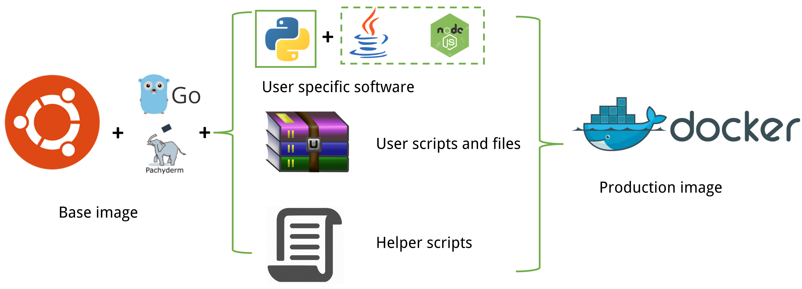
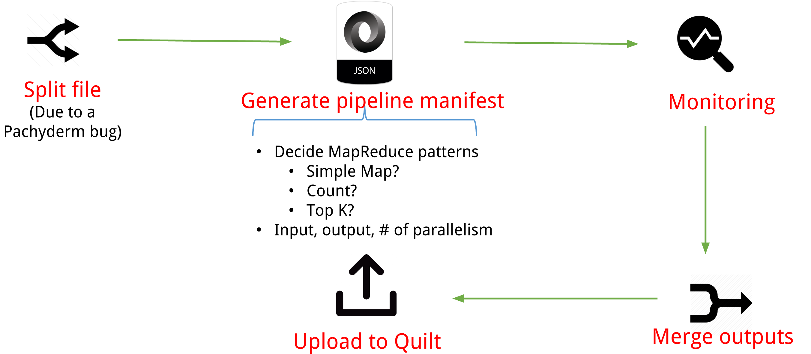

# Interface between QuiltData and Pachyderm

This is my Data Engineering project at the [Insight Data Science program](http://insightdataengineering.com/). It is on the consulting project from [QuiltData](https://quiltdata.com/) to implement an automatic interface in building data pipeline and processing large amount of data in parallel with [Pachyderm engine](http://pachyderm.io/).

This document serves two purposes:
- Describe my project to general audience
- Describe the technical usage and implementation to QuiltData

# Table of contents

1. [QuiltData](README.md#quiltdata)
2. [Pachyderm intro and deployments](README.md#pachyderm-intro-and-deployments)
3. [API design](README.md#api-design)
4. [Docker image preparation](README.md#docker-image-preparation)
5. [Pipeline generation](README.md#pipeline-generation)
6. [Test case](README.md#test-case)
7. [Implementation for Quilt](README.md#implementation-for-quilt)
8. [Future developments](README.md#future-developments)

## QuiltData

[Back to Table of Contents] (README.md#table-of-contents)

QuiltData is a collborative database that allows people to visiualize and analyze data with the minimal coding effort. Please follow the [installation instructions](https://github.com/quiltdata/python-api) to initialize your QuiltData environment.

## Pachyderm intro and deployments

[Back to Table of Contents] (README.md#table-of-contents)

Pachyderm is a new and evolving processing engine with the following features:
- Version control of data commits, which gives the users reproducibility of the previous data.
- Containerized analysis, which makes building the application easy and portable.
- Infrastructure agnostic, so it can be started in the cloud or on-premise 

In this project, the Pachyderm is deployed in the Google Container Engine, but this can be migrated to other platforms with Kubernetes settings configured.

## API design

[Back to Table of Contents] (README.md#table-of-contents)

The API is designed the as the picture below. On the user side, he/she can directly interact with the Quilt python API, making the API call of `compute`. The task is then sent to the backend and the following steps will start (which is implemented in this project):
- Build the Docker image, which contains user environments, scripts and dependent files
- Generate the pipeline manifest, including the MapReduce patterns, pallelism and inputs/outputs
- Submit the job to Pachyderm cloud, monitor the job status, download the output and upload back to Quilt immediately after the job finishes

## Docker image preparation

[Back to Table of Contents] (README.md#table-of-contents)

The Docker image is the starting point of every processing jobs, so it must have the same environment settings as user runs his/her script(s). Also the user's script(s) will be added as the executable(s), plus the dependent files (usually the trained model pickles or auxilary inputs besides the tables themselves).

Here we first prepare the base image, which will be used as the starting point of all kinds of jobs. We start from Ubuntu 16.04, install the GO languange v1.7 (due to denpendency) and the Pachyderm environment which is done as described in [this Dockerfile](https://github.com/fuquan-wang/quilt-pachyderm-interface/blob/master/Dockerfile/BaseImage/Dockerfile). We plan to add other Linux flavors for users to choose in case this is important for some use cases, but as an ad-hoc solution, user can use the desired flavor and build his/her base image.

Starting from the base image, we will add the following elements to make it the running environment:
- The user specific softwares/libraries. Currently the Python libraries are supported via Python Package Index (`pip`) and we encourage user to prepare the requirements.txt via `pip freeze`. The java libraries are planned to be supported via Maven. As an alternative, the CLI installation will be supported soon via `apt-get install` or `yum install` depending on Linux flavors.
- The user script(s) and dependent file(s). Currently we take an input file(s) in a directory and zipped in the format of `.tar` or `.tar.gz`. We encourage the user to finish this step by hand, but we plan to make this easier. We also suggest the user to make the main script read the full table as on Quilt server and write to a desired file.
- The helper scripts. This helps the user to finish multiple processings though the user script(s) only need to run locally on one file. In addition, other scripts are also provided in case user needed. For example, the test case (rule set 2 RNA scoring) gives only a script with inputs of a string (one column in the table) and output to stdout, so a helper script with sending required strings to the user script and writing to a file is added. However, this is not automatically done yet.

## Pipeline generation

[Back to Table of Contents] (README.md#table-of-contents)

The data pipeline in Pachyderm can implement MapReduce pattern as in Hadoop ecosystem via JSON manifest. Currently the simple mapping pipeline is automatically generated as it is most common and takes most of the time for multiple processings. The counting MapReduce pattern is also supported with or without a column as counting weight, and the top K MapReduce pattern can be achieved based on the counting results. The other common MapReduce patterns will also be added soon, including sorting, shuffling and table joining.
The Pachyderm JSON manifest will be automatically generated, specifying input repository, the processing commands, parallelism and output name. There were bugs in Pachyderm (v1.2.0-RC2) for sheduling parallel jobs during the project development, including
- File partition is not working but said to be fixed in v1.2.1
- Block partition is splitting the files into very uneven pieces
Therefore a workaround is included in this project. The files will be splitted according to the parallelism using an automatic pipeline, then submitted the processing jobs to Pachyderm, where it will not apply splittings any more. Afterwards, the output will be merged into a single file. This bug fix is user transparent.

## Test case

[Back to Table of Contents] (README.md#table-of-contents)

This interface is tested with calculating the rule set 2 scores on human RNA. The input table can be found on [QuiltData](https://quiltdata.com/app/table/2059) with 12 million rows. The processing scripts can be found at [Board Institute](http://portals.broadinstitute.org/gpp/public/dir/download?dirpath=software&filename=Rule_Set_2_scoring_v1.2.tar.gz).

Processing the table with one single process (Intel Xenon @ 2.2 GHz) will take 100 days. With this interface, it is trivial to process it in the parallel way with an arbitrary number of parallelism. As shown on the chart below, it does not make more than 1 API call to make it 100 times faster.

## Implementation for Quilt

[Back to Table of Contents] (README.md#table-of-contents)

This section is intended only for the QuiltData technicians for the integration. The following steps need to be finished before the interface to be functional:

1. Setup up the Pachyderm controller. This needs to follow the instructions on setting [Kubernetes]() and [Pachyderm](). Afterwards, please use the corresponding setup bash scripts in `pachydermDeploy` directory to bring up the cluster. Once the `pachd` pod is up, please start the port forwarding with `pachctl port-forward &` and this process needs to be alive.
2. If the Pachyderm controller is not the server of Quilt service, please use secure ports (`ssh` should do the work) to communicate between these two machines.
3. Once the `Compute` class is in the quilt API, the designed calling methods are 
<pre>
compute = quilt.Compute(args)
compute.do_calc()
</pre>
4. Please keep the files on the Pachyderm controller and set the environment variable `QUILT_COMPUTE_DIR` to the storage location of the repository.
5. Log into a Docker hub account as the process include the image building and pushing process. Also update the username in `bash-templ` directory for the Docker hub account.

## Future developments

[Back to Table of Contents] (README.md#table-of-contents)

This work is done in a time span of 3 weeks while I was a Data Engineering Fellow at the Insight Data Science Program. A significant portion of my time was spent on learning the new tools and fighting against bugs in Pachyderm (v1.2.0-RC1 and v1.2.0-RC2). However, this project is beneficial for all analysts/data scientists by minimizing their time to provision or manage clusters, so I plan to continue to polish this project. The following features are being considered:
- More MapReduce patterns
- Suggest MapReduce patterns automatically based on use case
- Include the support for Java and Node.js

